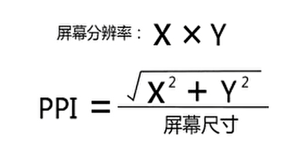
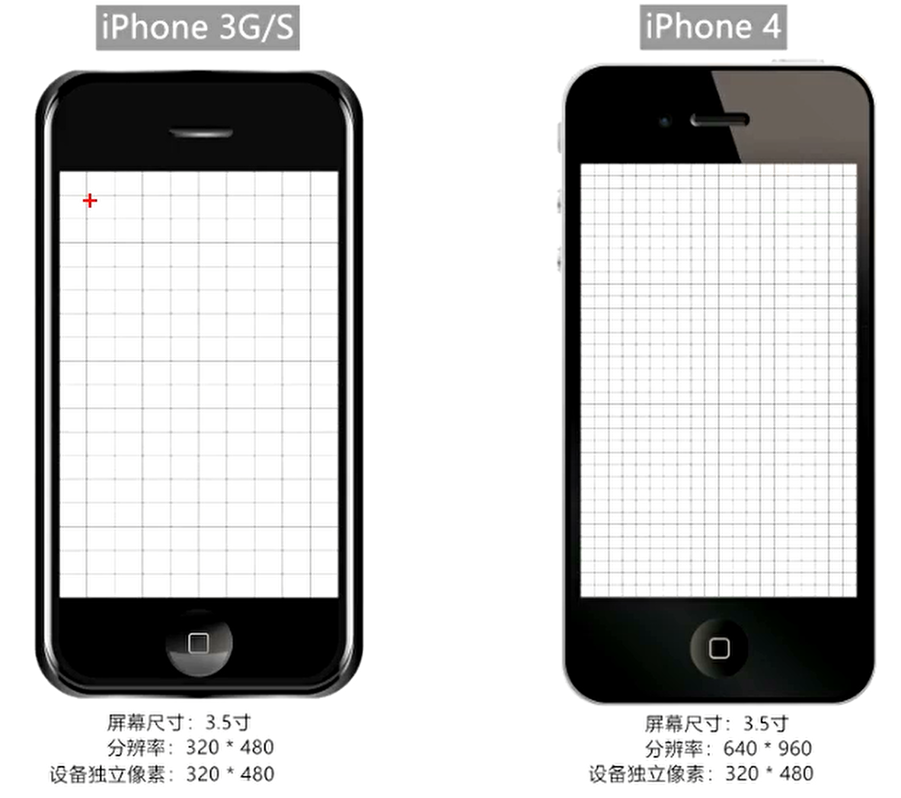
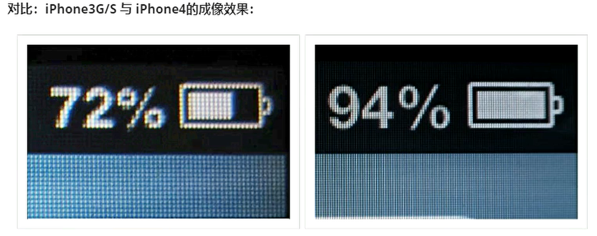
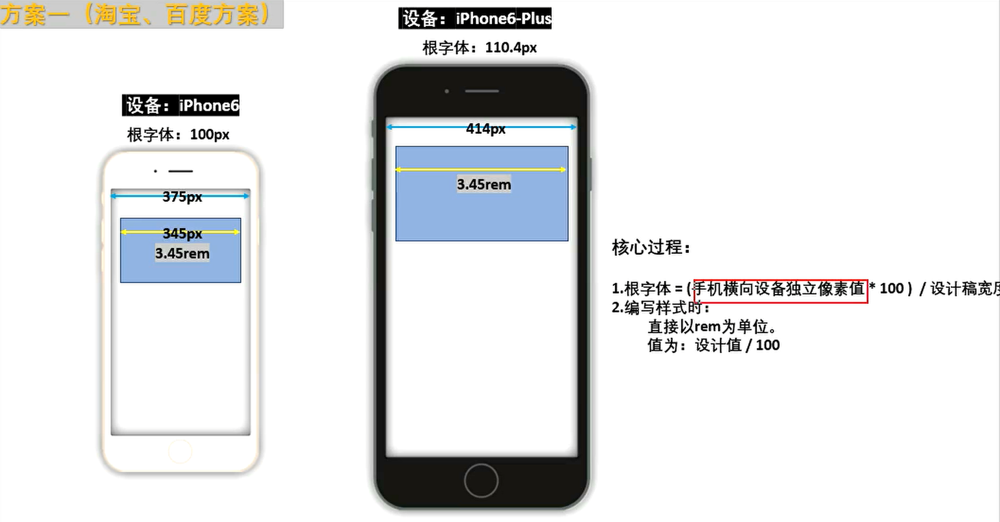
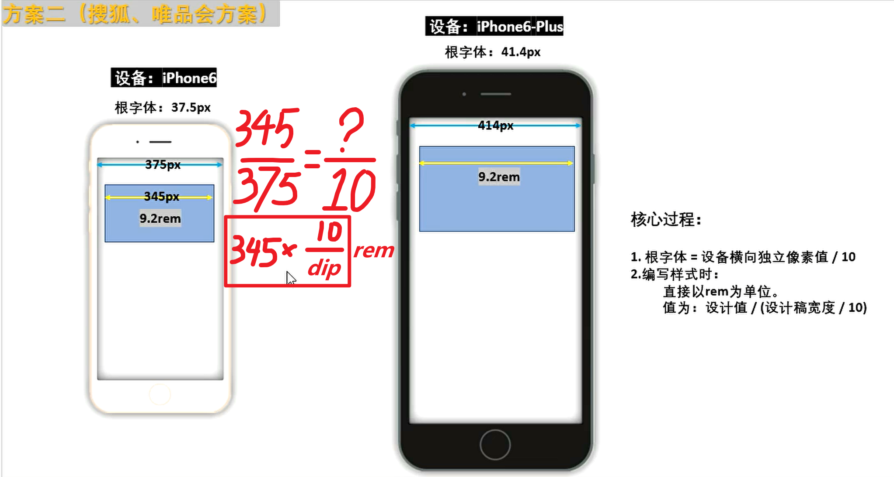

# 移动端开发

## 相关概念

### 屏幕相关
#### 1. 屏幕大小
  指屏幕对角线长度，单位是英寸（inch）。常见尺寸有：3.5寸、4.0寸、5.0寸、5.5寸、6.0寸等等。
    
  **备注：1英寸（inch）= 2.54 厘米（cm）**

#### 2. 屏幕分辨率
  是指屏幕在：横向、纵向上的**物理像素点**总数，一般用 n * m 表示。
  例如：iPhone6 的屏幕分辨率为： **750 * 1334**

* 注意：
    - **屏幕分辨率是一个固定值，无法修改！！**
    - 屏幕分辨率、显示分辨率是两个概念，系统设置中可以修改的是：显示分辨率。
    - 屏幕分辨率 >= 显示分辨率

##### 常见手机分辨率

|         型号         | 分辨率（物理像素点总和） |
| :------------------: | :----------------------: |
|   iPhone 3G / 3GS    |        320 * 480         |
|    iPhone 4 / 4s     |        640 * 960         |
|    iPhone 5 / 5s     |        640 * 1136        |
| **iPhone 6 / 7 / 8** |      **750 * 1334**      |
| iPhone 6p / 7p / 8p  |       1242 * 2208        |
|       iPhone X       |       1125 * 2436        |
|      HAWEI P30       |       1080 * 2340        |
|     HAWEI Mate40     |       2772 * 1344        |
|       小米 10        |       2340 * 1080        |
|       小米 11        |       3200 * 1440        |

#### 3. 屏幕密度
​    又称：屏幕像素密度，是指屏幕上**每英寸里包含的物理像素点个数**，单位是ppi（pixels per inch），其实这里还有另一个单位 dpi （dots per inch)，两个值的计算方式都一样，只是使用的场景不同。
​    ppi主要用来衡量屏幕，
​    dpi主要用来衡量打印机、投影仪等。



### 像素相关
#### 1. 物理像素
   **物理像素又名：设备像素**，是一个长度单位（px）。一个物理像素就是屏幕上的一个物理成像点，就是屏幕中一个微小的发光物理元器件（可简单理解为超级微小的灯泡），是屏幕能显示的最小粒度。屏幕的物理像素点数（分辨率）是手机屏幕的一个重要参数，**由屏幕制造商决定，屏幕生产后无法修改**。例如iPhone6 横向上拥有的物理像素为750、纵向上拥有 的物理像素为1334，用750*1334表示。


#### 2. css 像素
​    css像素又名：逻辑像素，css像素是一个抽象的长度单位，单位也是px，它是为Web开发者创造的，用来精确地度量Web页面上的内容大小。我们在编写css\js\less中所使用的都是css像素。

#### 3. 设备独立像素
  设备独立像素简称DIP或DP（device-independent pixel），又称：屏幕密度无关像素。
> 引言：在没出现【高清屏】的年代，1个css像素对应1个物理像素，但自从【高清屏】问世，二者就不再是1对1的关系了。苹果公司在2010年推出了一种新的显示标准:**在屏幕尺寸不变的前提下**，把更多的物理像素点压缩至一块屏幕里，这样分辨率就会更高，显示效果就会更佳细腻。苹果将这种屏幕称为: **Retina屏幕（又名:视网膜屏幕）**，与此同时推出了配备这种屏幕的划时代数码产品—iPhone4。


程序员写了: width=2px， height=2px的盒子，若1个css像素直接对应1个物理像素，由于 iPhone3G/S与iPhone4屏幕尺寸相同，但iPhone4的屏幕能容纳下更多的物理像素点，所以iPhone4的物理像素点比iPhone3G/S小很多，那么理论上这个盒子在 iPhone4屏幕上也就会比iPhone3G/S屏幕上小很多，而事实是 iPhone3G/S和 iPhone4下这个盒子是一样大的！！！，只不过 iPhone4更加细腻、清晰。如何做到的呢？这就要靠设备独立像素。



设备独立像素的出现，使得即使在【高清屏】上元素也可以拥有正常的尺寸，s让代码不受到设备的影响，它是设备厂商根据屏幕特性设置的，无法更改。

##### 设备独立像素与css像素关系：
- 在标准情况下（无缩放）：1 css像素 = 1 设备独立像素

##### 设备独立像素与物理像素关系：
- 普通屏幕下：1 设备物理像素 = 1 物理像素
- 高清屏幕下：1 设备物理像素 = N 物理像素

#### 4.像素比
像素比（dpr，device pixel ratio）：单一方向上，【物理像素】和【设备独立像素】的比值。即：**dpr = 物理像素 / 设备独立像素**
* 使用js获取dpr： window.devicePixelRatio
* 几款手机的屏幕像素参数：

|         型号         | 分辨率（物理像素点总和） | 设备独立像素（dip或dp） | 像素比（dpr） |
| :------------------: | :----------------------: | :---------------------: | :-----------: |
|   iPhone 3G / 3GS    |        320 * 480         |        320 * 480        |       1       |
|    iPhone 4 / 4s     |        640 * 960         |        320 * 480        |       2       |
|    iPhone 5 / 5s     |        640 * 1136        |        320 * 568        |       2       |
| **iPhone 6 / 7 / 8** |      **750 * 1334**      |      **375 * 667**      |     **2**     |
| iPhone 6p / 7p / 8p  |       1242 * 2208        |        414 * 736        |       3       |
|       iPhone X       |       1125 * 2436        |        375 * 812        |       3       |

https://uiiiuiii.com/screen/index.htm

### 图片高清显示
#### 位图像素
位图和矢量图
* 位图：又称点阵图形或栅格图像，是由n个的像素点组成的。放大后会失真。（常见：png、jpeg、jpg、gif）
一般用PhotoShop等软件进行编辑。
* 矢量图：又称为面向对象图像或绘图图像，在数学上定义为一系列由线连接的点，放大后不会失真。（常见：svg）
一般使用Adobe Illustrator，Sketch等软件进行编辑

位图像素也是一个长度单位，**位图像素**可以理解为位图中的一个“小格子”，是位图的最小单元。


#### 图片的高清显示（媒体查询）
```css
@media screen and (-webkit-min-device-pixel-ratio:2) {
      .logo{
        content: url(../imgs/logo@2x.jpg)
      }
    }
@media screen and (-webkit-min-device-pixel-ratio:3) {
  .logo{
    content: url(../imgs/logo@3x.jpg)
  }
}
```

### 视口相关
#### PC端视口
  在pc端，视口的默认宽度和浏览器窗口的宽度一致。在css标准文档中，视口也被称作：初始包含块，它是所有css百分比宽度推算的根源，在PC端可通过如下几种方式获取宽度：
```js
    console.log('最干净的显示区域', document.documentElement.clientWidth); // 常用
    console.log('最干净的显示区域+滚动条', window.innerWidth);
    console.log('最干净的显示区域+滚动条+浏览器边框', window.outerWidth);
    console.log('与浏览器无关，当前设备显示分辨率横向的值', screen.width);
```

#### 移动端视口
在移动端，浏览器厂商面临着一个比较大的问题：他们如何将数以万计甚至可以说是数以亿计的pc端网页完整的呈现在移动端设备上，并且不会出现横向滚动条呢？那就要引出移动端的三个概念:**1.布局视口、2.视觉视口、3.理想视口**

##### 1.布局视口 Layout viewport
用于解决早期的页面在手机上显示的问题，早期的时候我们这样做:pc端网页宽度一般都为:960px~1024px这个范围，就算超出了该范围，960px~1024px这个区域也依然是版心的位置。

浏览器厂商针对移动端设备设计了一个容器，先用这个容器去承装PC端的网页，这容器的宽度一般是**980px**，不同的设备可能有所差异，但相差并不大;随后将这个容器**等比例**压缩到与手机等宽，这样就可以保证没有滚动条且能完整呈现页面，但是这样做依然有问题:网页内容被压缩的太小，严重影响用户体验。

移动端获取布局视口的方式：```document.documentElement.clientWidth```
(一般都是980px，iPad Pro是1024px)

**注意：布局视口经过压缩后，横向的宽度用css像素表达就不再是375px了，而是980px，因为布局视口是被压缩，而不是截取。**

##### 2.视觉视口 Visual viewport
视觉视口就是用户可见的区域，它的绝对宽度永远和设备屏幕一样宽，但是这个宽度里所包含的css像素值是变化的，例如:一般手机会将980个css像素放入视觉视口中 **（视觉视口大小=布局视口大小）**，而 ipad Pro会将1024个css像素放入视觉视口中。

移动端获取视觉视口方式: ```window.innerWidth```，不过在 Android2、 Opera mini、UC8中无法正确获取。（一般也不通过代码看视觉视口）

如果以iPhone6为例，描述一下屏幕：
1. 物理像素：750px
2. 设备独立像素： 375px
3. **css像素：980px** => 980px的布局视口被压缩进屏幕

##### 3.理想视口 Visual viewport
与屏幕（设备独立像素，dp/dip）等宽的布局视口，称之为理想视口，所以也可以说理想视口是一种标准:让布局视口宽与屏幕等宽（设备独立像素），靠meta标签实现。

* 理想视口的特点:
 1. 布局视口和屏幕等宽，以 iPhone6为例，符合理想视口标准之后:
  - 设备独立像素:375px
  - **布局视口宽度:375px**
 2. 用户不需要缩放、滚动就能看到网站的全部内容。
 3. 要为移动端设备单独设计一个移动端网站。

设置理想视口的具体方法:
```html 
<meta name="viewport" content="width=device-width">
```

【总结】:
* 不写meta标签（不符合理想视口标准）:
> 1.描述屏幕:物理像素:750p×、设备独立像素:375px、css像素:980px。
> 2.优点:元素在不同设备上，呈现效果几乎一样，因都是通过布局容器等比缩放的，例如200宽的盒子: 200/980
> 3.缺点:元素太小，页面文字不清楚，用户体验不好。
* 写meta标签（符合理想视口标准）:
> 1.描述屏幕:物理像素:750px、设备独立像素:375px、css像素:375px。
> 2.优点:页面清晰展现，内容不再小到难以观察，用户体验较好。
> 3.缺点:同一个元素，在不同屏幕（设备）上，呈现效果不一样，例如375宽的盒子:375/375和375/414（不是等比显示）
> 4.如何解决:做适配。


### 缩放
#### PC端缩放
放大时：
* 视口变小
* 元素的css像素值不变，但一个css像素所占实际面积变大了。
缩小时：
* 视口变大
* 元素的css像素值不变，但一个css像素所占实际面积变小了。
算法过程： 放大时，浏览器向内截取一定比例面积，然后立即把裁剩下的画面等比例撑满整个视口，放不下的元素自动换行。

监测脚本：
```js
console.log('pc端视口为：',document.documentElement.clientWidth)
// pc端， onresize监测的是视口的变化（初识包含块）
window.onresize = () => {
  console.log('pc端视口为：',document.documentElement.clientWidth)
}
```

#### 移动端缩放
放大时：
* 布局视口不变
* 视觉视口变小（软件模拟手机与人眼距离变远，因此手机内视觉范围变小，内容更大）
缩小时：
* 布局视口不变
* 视觉视口变大（软件模拟手机与人眼距离变近，因此手机内视觉范围变大，内容更小）

注意：移动端缩放不会影响页面布局，因为缩放的时候，布局视口大小没有变化。

## Viewport

meta-viewport标签是苹果公司在2007年引进的，用于移动端布局视口的控制，企图改变980布局视口的行业规则。
viewport相关选项：
1. width          布局视口宽度
2. initial-scale  系统初始缩放比例
3. maximum-scale  允许用户缩放的最大比例 【safari不支持】
4. minimum-scale  允许用户缩放的最小比例
5. user-scalable  是否允许用户缩放 【safari不支持】
6. viewport-fit   设置为cover值可以解决刘海屏的留白问题

### 1. width
width值可以是device-width，也可以是具体值，但有些安卓手机不支持具体值，IOS全系列支持
### 2. initial-scale
1. 页面初始化时的缩放比例
2. initial-scale = 屏幕宽度（设备独立像素，dip）/ 布局视口宽度
3. 只写 initial-scale = 1.0 也可以实现完美视口，但为了更好的兼容性，一般 ```width=device-width, initial-scale=1.0``` 一起写。
### 3. maximum-scale
允许用户缩放的最大比例 【safari不支持】
maximum-scale = 屏幕宽度（设备独立像素，dip）/ 视觉视口宽度
### 4. minimum-scale
允许用户缩放的最大比例
minimum-scale = 屏幕宽度（设备独立像素，dip）/ 视觉视口宽度
### 5. user-scalable
是否允许用户通过手指缩放页面 【safari不支持】
### 6. viewport-fit
设置为cover可以解决【刘海屏】的留白问题

* 一般移动端的基本用法：
```html
<meta name="viewport" content="width=device-width, initial-scale=1.0, maximum-scale=1.0, user-scalable=0, shrink-to-fit=no, viewport-fit=cover">
```

## 适配

一、为什么要做适配？
由于移动端设备的屏幕尺寸大小不一，会出现:同一个元素，在两个不同的手机上显示效果不一样（比例不同）。要想让同一个元素在不同设备上，显示效果一样，就需要适配，**无论采用何种适配方式，中心原则永远是:等比！**

主流的适配方式有三种：
* viewport适配
* rem适配（主流方式，几乎完美适配）
* vw适配

### 1.viewport适配
* 方法:拿到设计稿之后，设置布局视口宽度为设计稿兖度，然后直接按照设计稿给宽高进行布局即可
* 优点:不用复杂的计算，直接使用图稿上标注的pX值
* 缺点：
  - 不能使用完整的meta标签，会导致在某些安卓手机上有兼容性问题
  - 不希望适配的东西，例如边框，也强制参与了适配。

### 2.rem适配
#### em和rem
em和rem都是css中的长度单位。而且两个都是相对长度单位，不过两个有点区别
- em相对的是父级元素的字体大小
- rem相对的是根元素的字体大小
rem适配的原理:编写样式时统一使用rem为单位，在不同设备上动态调整根字体大小

#### rem方案一：核心原理
理想视口下，以设计稿（dip为375px）为标准，根字体设计为100px，来匹配其它设备的dip
1. 根字体大小 = 手机横向设备独立像素值 / 设计稿宽度 * 100 px
2. 编写样式时：
    - 直接以rem为单位
    - 值 = 设计稿值 / 100 



#### rem方案二：核心原理
理想视口下，根字体设为dip/10，即把dip比作10份rem，考虑内部元素的占多少rem
1. 根字体大小 = 手机横向设备独立像素值 / 10
2. 编写样式时：
    - 直接以rem为单位
    - 值 = 设计稿值 * （10/dip）
3. 该方案结合less将无敌



### 3.vw适配(百分比)
1 vw = 布局视口宽度的1%
2 vh = 布局视口高度的1%

查看兼容性： caniuse.com
